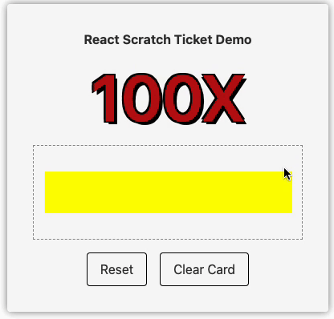
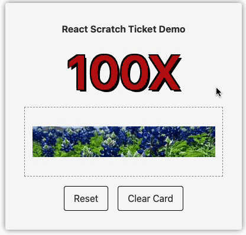

<h1 align="center">Welcome to react-scratch-ticket 👋</h1>
<p>
  
  
  <a href="https://github.com/RexHung0302/react-scratch-ticket#readme" target="_blank">
    
  </a>
  <a href="https://github.com/RexHung0302/react-scratch-ticket/graphs/commit-activity" target="_blank">
    
  </a>
  <a href="https://github.com/RexHung0302/react-scratch-ticket/blob/master/LICENSE" target="_blank">
    
  </a>
</p>

[En](README.md) | [繁中](README-tw.md) | [简中](README-cn.md)

> This is a scratch ticket component, basic on React

## 🚨🚨 Readme First Please 🚨🚨

这个套件的启发为 **[react-scratchcard-v2](https://github.com/dopey2/react-scratchcard-v2)** 和 **[scratch-card](https://github.com/1587315093/scratch-card)**，在刚开始安装时，发现前者无法在手机上使用，后者则是没有一键刮开所有蒙层的功能，在几经思索之下自行使用 Canvas 和 React 製作了这个刮刮卡套件。

在考量到手机使用的部分，使用了 `canvas.addEventListener('touchstart', startScratching);`、`canvas.addEventListener('touchend', startScratching);` 和 `canvas.addEventListener('touchmove', touchMoveHandler)`；在一键刮开的部分则是直接使用 `ctx.clearRect(0, 0, width, height);` 揭开画布蒙层。

如果后续你有更多想法，想要在这个套件上使用，欢迎至 **[issues](https://github.com/RexHung0302/react-scratch-ticket/issues)** 留下你的想法，作者也会在之后更新更多想法，**[todo-list](#todo-list)** 将会在下方，最后希望这个套件能够让您使用的愉快，感谢，祝你有美好的一天。

### 🏠 [Homepage](https://github.com/RexHung0302/react-scratch-ticket#readme)

### ✨ [Demo](https://rexhung0302.github.io/react-scratch-ticket)


> 使用 Prop maskingLayerColor 传入蒙层颜色


> 使用 Prop maskingLayerImg 传入蒙层图片


> 重置 及 一键清空 功能


## 需求

- npm >=10.0.0
- node >=20.0.0

## 安装

```sh
npm i react-scratch-ticket
```

```sh
yarn i react-scratch-ticket
```

```sh
pnpm i react-scratch-ticket
```

## 使用

### 在你的元件内使用

```tsx
import React from "react";
import { ReactScratchTicket } from "react-scratch-ticket";
import ReactDOM from "react-dom/client";
import useIndexController from "./hook/useIndexController";
import './style.scss';

const App = () => {
  const { prizeInfo, scratchTicketRef, completeHandler, initDoneHandler, resetDoneHandler, clickResetBtnHandler, clickClearCardBtnHandler } = useIndexController();

  return (
    <div className="container">
      <h2 className="font-bold">React Scratch Ticket Demo</h2>
      <p className="container__title">100X</p>
      <div className="content">
        <ScratchTicket
          ref={scratchTicketRef}
          containerClassName="rounded-[10px] my-4"
          brushSize={10}
          width={309}
          height={52}
          childrenCenter
          maskingLayerImg='https://picsum.photos/309/52'
          maskingLayerColor="yellow"
          finishPercent={70}
          onComplete={completeHandler}
          onInitDone={initDoneHandler}
          onResetDone={resetDoneHandler}
        >
          {prizeInfo.name}
        </ScratchTicket>
      </div>
      <div className="flex gap-4 mt-4">
        <button onClick={clickResetBtnHandler} className="button">Reset</button>
        <button onClick={clickClearCardBtnHandler} className="button">Clear Card</button>
      </div>
    </div>
  );
};
```

### useIndexController.tsx

```ts
import { useEffect, useRef, useState } from "react";
import { ScratchTicketImperative } from "react-scratch-ticket";

/**
 * @description Fake Prize Array
 */
const fakePrizeArray = [
  { name: "You will have a nice day" },
  { name: "Keep up the good work" },
  { name: "You are awesome, win $9999 cash" },
  { name: "You are the best, win a car" },
  { name: "$1000 cash" },
  { name: "$5000 cash" },
];

const useIndexController = () => {
  const scratchTicketRef = useRef<ScratchTicketImperative>(null);
  const [prizeInfo, setPrizeInfo] = useState({ name: "Keep up the good work" });

  /**
   * @description init done handler
   */
  const initDoneHandler = () => console.log("init done");

  /**
   * @description complete handler
   */
  const completeHandler = () => console.log("complete");

  /**
   * @description reset done handler
   */
  const resetDoneHandler = () => console.log("reset done");

  /**
   * @description click reset button handler
   */
  const clickResetBtnHandler = () => {
    scratchTicketRef.current?.reset()
  };

  /**
   * @description click clean card button handler
   */
  const clickClearCardBtnHandler = () => scratchTicketRef.current?.clearCard();

  /**
   * @description Init Random Prize
   */
  useEffect(() => {
    const randomIndex = Math.floor(Math.random() * fakePrizeArray.length);
    setPrizeInfo(fakePrizeArray[randomIndex]);
  }, []);


  return {
    prizeInfo,
    scratchTicketRef,
    completeHandler,
    initDoneHandler,
    resetDoneHandler,
    clickResetBtnHandler,
    clickClearCardBtnHandler,
  }
};

export default useIndexController;
```

## Type

### Props

|  Name   | Type  | Required | Default |
|  ----  | ----  | ----  | ----  |
| width  | `number` | ✅ | |
| height  | `number` | ✅ | |
| children  | `React.ReactNode` | ✅ | |
| brushType  | `'circle' \| 'square'` |  | `'circle'` |
| brushSize  | `number` |  | `20` |
| finishPercent  | `number` |  | `50` |
| maskingLayerImg  | `string` |  | |
| maskingLayerColor  | `string` |  | `#ddd` |
| animationDuration  | `number` |  | `50` |
| containerClassName  | `string` |  | |
| childrenCenter  | `boolean` |  | `false` |
| onComplete  | `() => void` |  | `() => {}` |
| onInitDone  | `() => void` |  | `() => {}` |
| onResetDone  | `() => void` |  | `() => {}` |

### Ref

|  Name   | Type  | Description |
|  ----  | ----  | ----  |
| reset | `() => void` | 重置刮刮卡，恢復为未刮开的状态，允许再次刮开。 |
| clearCard | `() => void` | 立即刮开刮刮卡，显示底下的奖品内容。 |

## todo-list

> 请查看 [En](README.md)，待办清单将会在英文的 **README.md** 一次性更新

## 作者

👤 **RexHung0302**

* Website: https://rexhung0302.github.io/
* Github: [@RexHung0302](https://github.com/RexHung0302)
* LinkedIn: [@https:\/\/www.linkedin.com\/in\/chiatse-hung-908b72204\/](https://linkedin.com/in/https:\/\/www.linkedin.com\/in\/chiatse-hung-908b72204\/)

## 🤝 贡献

Contributions, issues and feature requests are welcome!<br />Feel free to check [issues page](https://github.com/RexHung0302/react-scratch-ticket/issues). You can also take a look at the [contributing guide]( ).

## 提供你的支持

请别吝啬给我一颗 ⭐️ 如果这个专案帮助到你！

## 📝 License

Copyright © 2025 [RexHung0302](https://github.com/RexHung0302).<br />
This project is [MIT](https://github.com/RexHung0302/react-scratch-ticket/blob/master/LICENSE) licensed.

***
_This README was generated with ❤️ by [readme-md-generator](https://github.com/kefranabg/readme-md-generator)_