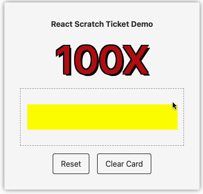
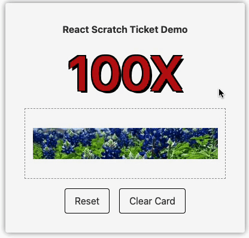
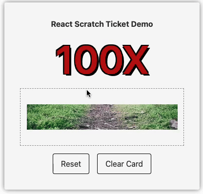

<h1 align="center">Welcome to react-scratch-ticket 👋</h1>
<p>
  
  
  <a href="https://github.com/RexHung0302/react-scratch-ticket#readme" target="_blank">
    
  </a>
  <a href="https://github.com/RexHung0302/react-scratch-ticket/graphs/commit-activity" target="_blank">
    
  </a>
  <a href="https://github.com/RexHung0302/react-scratch-ticket/blob/master/LICENSE" target="_blank">
    
  </a>
</p>

[En](README.md) | [繁中](README-tw.md) | [簡中](README-cn.md)

> This is a scratch ticket component, basic on React

## 🚨🚨 Readme First Please 🚨🚨

This package is inspired by **[react-scratchcard-v2](https://github.com/dopey2/react-scratchcard-v2)** and **[scratch-card](https://github.com/1587315093/scratch-card)**. Upon initial installation, I found that the former did not work on mobile devices, and the latter lacked the feature to reveal the entire scratch ticket with one click. After some consideration, I decided to create this scratch ticket component using canvas and React.

To address mobile usage, I implemented `canvas.addEventListener('touchstart', startScratching)`, `canvas.addEventListener('touchend', startScratching)` and `canvas.addEventListener('touchmove', touchMoveHandler)` for touch events. For the "Clear card" feature, I used `ctx.clearRect(0, 0, width, height)` to reveal the canvas layer.

If you have any ideas or features you'd like to see added to this package, feel free to leave them in the **[issues](https://github.com/RexHung0302/react-scratch-ticket/issues)** section. The author will continue to update with more ideas. A **[todo-list](#todo-list)** will be available below. Lastly, I hope this package enhances your experience, and I wish you a wonderful day. Thank you!

### 🏠 [Homepage](https://github.com/RexHung0302/react-scratch-ticket#readme)

### ✨ [Demo](https://rexhung0302.github.io/react-scratch-ticket)


> With Background Color Demo


> With Background Image Demo


> Reset and Clear function


## Prerequisites

- npm >=10.0.0
- node >=20.0.0

## Install

```sh
npm i react-scratch-ticket
```

```sh
yarn i react-scratch-ticket
```

```sh
pnpm i react-scratch-ticket
```

## Usage

### Use in your Component

```tsx
import React from "react";
import ScratchTicket from "react-scratch-ticket";
import useIndexController from "./useIndexController.ts";
import './style.scss';

const App = () => {
  const { prizeInfo, scratchTicketRef, completeHandler, initDoneHandler, resetDoneHandler, clickResetBtnHandler, clickClearCardBtnHandler } = useIndexController();

  return (
    <div className="container">
      <h2 className="font-bold">React Scratch Ticket Demo</h2>
      <p className="container__title">100X</p>
      <div className="content">
        <ScratchTicket
          ref={scratchTicketRef}
          containerClassName="rounded-[10px] my-4"
          brushSize={10}
          width={309}
          height={52}
          childrenCenter
          maskingLayerImg='https://picsum.photos/309/52'
          maskingLayerColor="yellow"
          finishPercent={70}
          onComplete={completeHandler}
          onInitDone={initDoneHandler}
          onResetDone={resetDoneHandler}
        >
          {prizeInfo.name}
        </ScratchTicket>
      </div>
      <div className="flex gap-4 mt-4">
        <button onClick={clickResetBtnHandler} className="button">Reset</button>
        <button onClick={clickClearCardBtnHandler} className="button">Clear Card</button>
      </div>
    </div>
  );
};
```

### useIndexController.tsx

```ts
import { useEffect, useRef, useState } from "react";
import { ScratchTicketImperative } from "react-scratch-ticket";

/**
 * @description Fake Prize Array
 */
const fakePrizeArray = [
  { name: "You will have a nice day" },
  { name: "Keep up the good work" },
  { name: "You are awesome, win $9999 cash" },
  { name: "You are the best, win a car" },
  { name: "$1000 cash" },
  { name: "$5000 cash" },
];

const useIndexController = () => {
  const scratchTicketRef = useRef<ScratchTicketImperative>(null);
  const [prizeInfo, setPrizeInfo] = useState({ name: "Keep up the good work" });

  /**
   * @description init done handler
   */
  const initDoneHandler = () => console.log("init done");

  /**
   * @description complete handler
   */
  const completeHandler = () => console.log("complete");

  /**
   * @description reset done handler
   */
  const resetDoneHandler = () => console.log("reset done");

  /**
   * @description click reset button handler
   */
  const clickResetBtnHandler = () => {
    scratchTicketRef.current?.reset()
  };

  /**
   * @description click clean card button handler
   */
  const clickClearCardBtnHandler = () => scratchTicketRef.current?.clearCard();

  /**
   * @description Init Random Prize
   */
  useEffect(() => {
    const randomIndex = Math.floor(Math.random() * fakePrizeArray.length);
    setPrizeInfo(fakePrizeArray[randomIndex]);
  }, []);


  return {
    prizeInfo,
    scratchTicketRef,
    completeHandler,
    initDoneHandler,
    resetDoneHandler,
    clickResetBtnHandler,
    clickClearCardBtnHandler,
  }
};

export default useIndexController;
```

## Type

### Props

|  Name   | Type  | Required | Default |
|  ----  | ----  | ----  | ----  |
| width  | `number` | ✅ | |
| height  | `number` | ✅ | |
| children  | `React.ReactNode` | ✅ | |
| brushType  | `'circle' \| 'square'` |  | `'circle'` |
| brushSize  | `number` |  | `20` |
| finishPercent  | `number` |  | `50` |
| maskingLayerImg  | `string` |  | |
| maskingLayerColor  | `string` |  | `#ddd` |
| animationDuration  | `number` |  | `50` |
| containerClassName  | `string` |  | |
| childrenCenter  | `boolean` |  | `false` |
| onComplete  | `() => void` |  | `() => {}` |
| onInitDone  | `() => void` |  | `() => {}` |
| onResetDone  | `() => void` |  | `() => {}` |

### Ref

|  Name   | Type  | Description |
|  ----  | ----  | ----  |
| reset | `() => void` | Resets the scratch ticket to its initial state, allowing it to be scratched again. |
| clearCard | `() => void` | Immediately clears the scratch ticket, revealing the prize underneath. |

## TODO List

- [ ] Multiple scratchable areas on the same scratch ticket
- [ ] Clear animation optimization (e.g., automatic scratch animation from left to right, instead of disappearing all at once)
- [x] Release the first version

## Author

👤 **RexHung0302**

* Website: https://rexhung0302.github.io/
* Github: [@RexHung0302](https://github.com/RexHung0302)
* LinkedIn: [@https:\/\/www.linkedin.com\/in\/chiatse-hung-908b72204\/](https://linkedin.com/in/https:\/\/www.linkedin.com\/in\/chiatse-hung-908b72204\/)

## 🤝 Contributing

Contributions, issues and feature requests are welcome!<br />Feel free to check [issues page](https://github.com/RexHung0302/react-scratch-ticket/issues). You can also take a look at the [contributing guide]( ).

## Show your support

Give a ⭐️ if this project helped you!

## 📝 License

Copyright © 2025 [RexHung0302](https://github.com/RexHung0302).<br />
This project is [MIT](https://github.com/RexHung0302/react-scratch-ticket/blob/master/LICENSE) licensed.

***
_This README was generated with ❤️ by [readme-md-generator](https://github.com/kefranabg/readme-md-generator)_